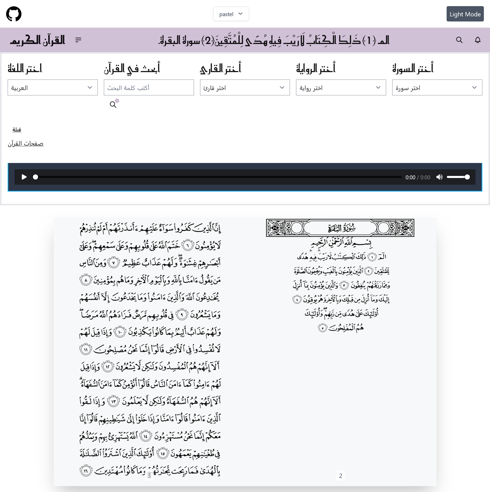

# 📖 Quran Page Flip Component

This component is designed for the upcoming holy month of Ramadan, providing a digital Quran reading experience with a page flip effect. It allows users to navigate through the Quran in a traditional right-to-left format, enhancing the spiritual journey during Ramadan.



## Features

- Right-to-left page flip effect
- Responsive design for various screen sizes
- Easy navigation through Quranic pages

## Installation

1. Clone the repository:

   ```bash
   git clone <repository-url>
   ```

2. Navigate to the project directory:

   ```bash
   cd quran-navbar
   ```

3. Install the dependencies:
   ```bash
   npm install
   ```

## Usage

To start the development server and view the component in action:

```bash
npm start
```

This will launch the application in your default web browser, allowing you to explore the Quran with a beautiful page flip effect.

## Contributing

Contributions are welcome! Please feel free to submit a Pull Request.

## License

This project is licensed under the MIT License.
